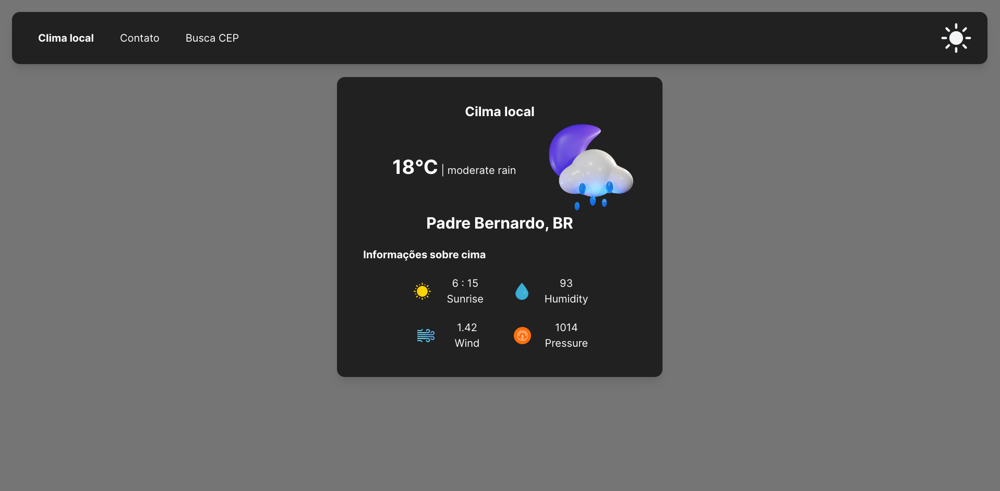
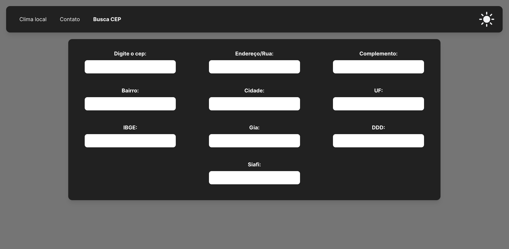
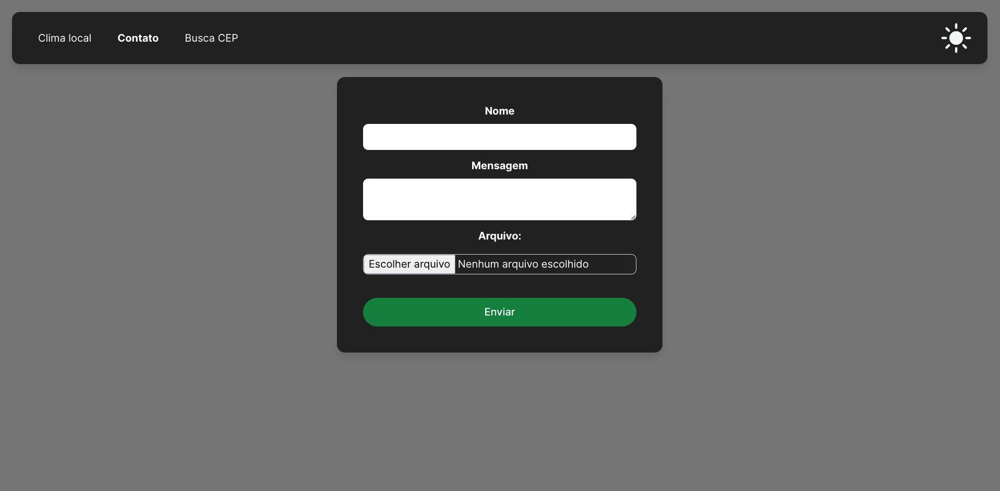

# Octokey desafio

## Como rodar passpo a passo:
1. Clone o projeto com `git clone https://github.com/prince-neres/weather-app.git`
2. Entre no diretório do projeto com `cd weather-app`
3. `npm i` ou `yarn`
4. `npm run dev` ou `yarn dev`
5. :warning: PARA QUE A APLICAÇÂO FUNCIONE CORRETAMENTE DEVE-SE PERMITIR A LOCALIZAÇÂO :warning:

## Preview:
<h3 align="center">Clima local</h3>

  

<h3 align="center">Busca CEP</h3>

  

<h3 align="center">Página de contato</h3>

  

## Tecnologias utilizadas:
* [Vite](https://vitejs.dev/)
* [React.js](https://pt-br.reactjs.org/)
* [Tailwind CSS](https://tailwindcss.com/)
* [React Router](https://reactrouter.com/en/main/start/tutorial)
* [OpenWeather API](https://openweathermap.org/api)
